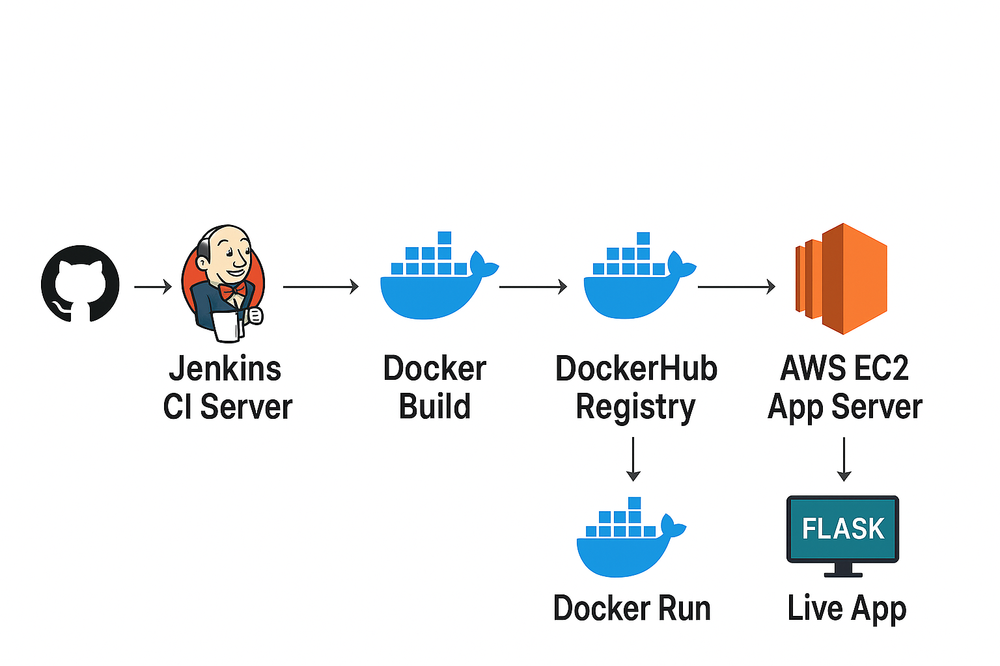
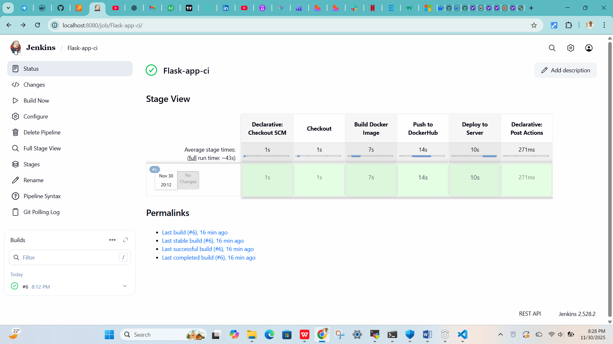

# 01-docker-flask-jenkins
Beginner-Friendly DevOps CI/CD Project – Flask App With Jenkins & Docker

This project is designed to help beginners understand how real DevOps pipelines work — step by step.
You will learn the basics of automation, Docker, Jenkins pipelines, GitHub workflows, and deployment.

Everything is broken down in simple terms so anyone can follow along.
##  Tech Stack
- Python (simple backend App)
- Jenkins (CI/CD)
- DockerHub (image registry)
- Github (version control)

---

##  Architecture


1. Developer pushes code to GitHub  
2. Jenkins pulls code → builds Docker image  
3. Jenkins pushes image to DockerHub  
4. (Optional) Jenkins deploys container to EC2 or Kubernetes  

---

## Table of Contents
1. Overview
2. Architecture
3. Features
4. Tech Stack
5. Repository Structure
6. Prerequisites + Documentation
7. Local Setup
8. Docker Setup
9. Jenkins CI/CD Pipeline
10. Deployment Flow
11. Troubleshooting
12. Future Enhancements
    
---

## Features
CI Features
Automated build on every push
Linting
Unit testing
Build artifact versioning
Docker image tagging
Push to DockerHub

CD Features
Automatic deployment to Dev environment
Manual approval for Production
Rollback-ready structure
Environment-based configuration

---

## Project Structure
-app/
  -main.py
  -requirements.txt
-Jenkinsfile
-Dockerfile
-README.md
-assets/
  -deployment-flow.png
  -kubernetes/  # optional

---    

## Prerequisites + Documentation Links

1️⃣ **Git** – Install Git: [Git Docs](https://git-scm.com/book/en/v2/Getting-Started-Installing-Git)  
2️⃣ **Python 3** – Install Python: [Python Downloads](https://www.python.org/downloads/)  
3️⃣ **Docker** – Install Docker Engine: [Docker Docs](https://docs.docker.com/engine/install/)  
4️⃣ **Jenkins** – Install Jenkins on Ubuntu: [Jenkins Docs](https://www.jenkins.io/doc/book/installing/)  
5️⃣ **DockerHub Account** – Sign up: [DockerHub](https://hub.docker.com/signup)  

## Run Locally
```bash
# Clone the repository
git clone https://github.com/tambe-devops/01-docker-flask-jenkins.git
cd 01-docker-flask-jenkins

# Build Docker image
docker build -t flask-jenkins:latest .

# Run Docker container
docker run -p 5000:5000 flask-jenkins:latest
# Visit 👉 http://localhost:5000
```

---

## Who Is This Project For?

Perfect for:
Beginners in DevOps
People building a DevOps portfolio
Students preparing for interviews
Anyone who wants to deploy a real app end-to-end

---

## Conclusion

This project is built to represent real-world DevOps engineering standards — with CI/CD, automation, containerization, and architectural thinking.
It demonstrates:
Your ability to set up pipelines
Deployment automation
Docker best practices
Advanced repo organization
Production-ready DevOps mindset
## Pipeline
At the final stage of the deployment this is what you should expect after a successful pipeline

